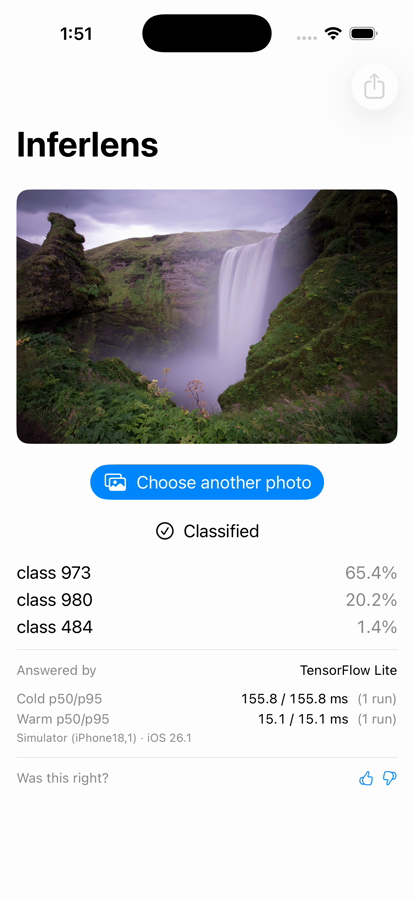
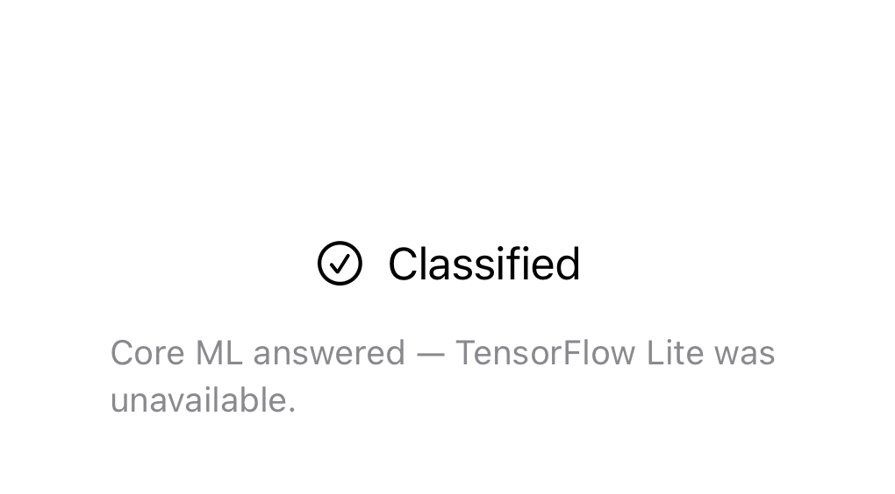
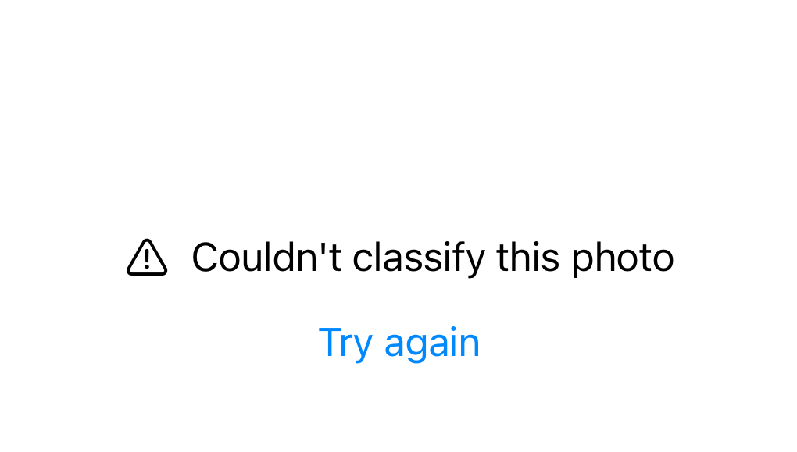
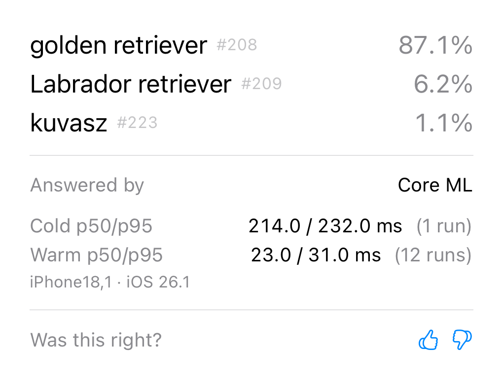

<div align="center">

# Inferlens

**Measure on-device inference on your own iPhone — not a vendor's published number.**

An iPhone app that names what it sees without sending the photo anywhere, runs the same
picture through two engines, and logs how long each took — so the app that classifies
images is also the harness that measures which engine to ship.

[](.swift-version)
[](docs/adr/0001-module-boundaries.md)
[](.xcode-version)
[](LICENSE)
[](docs/ROADMAP.md)
[](https://github.com/sebkoo/inferlens/actions/workflows/commit-hygiene.yml)
[](https://github.com/sebkoo/inferlens/actions/workflows/build.yml)
[](CONTRIBUTING.md)

</div>

*Most of these badges are pins, not scores. Swift 6.3, iOS 26, and Xcode 26 are toolchain
decisions recorded in [ADR-0001](docs/adr/0001-module-boundaries.md) and checkable in
[`.swift-version`](.swift-version) and [`.xcode-version`](.xcode-version) — they state
what the repo targets, not what it has measured. Three report something measured: the rungs
badge (how many rungs have landed), the commit-hygiene badge — a scoped workflow badge that
links to [its workflow](.github/workflows/commit-hygiene.yml) and reports exactly that the
AI-trailer lint passes on every push — and the build + test badge, which links to
[its workflow](.github/workflows/build.yml) and reports that the suite builds and passes on every
push. A reader can click either through and check what it covers. There is still no generic
`CI | passing` or coverage badge: each badge here names its own scope and links to a file the
reader can check, which a generic label — implying coverage it does not measure — would not.*

## See it run

Forty-three seconds, one take, no cuts: launch, classify, thumbs, a second photo, export.

https://github.com/user-attachments/assets/384752bb-9392-4903-83ae-7f1c339580f7

*The player above is a compressed preview: the same 42.7 s take, re-encoded to fit GitHub's 10 MB
inline ceiling — compressed, never cut (576 frames in, 576 frames out; the duration matches). A
preview carries no claim; the artifact of record is the release, one line below — the full take,
and
[the preview's own bytes](https://github.com/sebkoo/inferlens/releases/download/demo-sim-ac8d402/inferlens-shell-demo-preview.mp4)
mirrored beside it, each with a sha256 digest recorded per asset on the release.*

<a href="https://github.com/sebkoo/inferlens/releases/download/demo-sim-ac8d402/inferlens-shell-demo.mp4"></a>

*A frame of
[the 43-second recording](https://github.com/sebkoo/inferlens/releases/download/demo-sim-ac8d402/inferlens-shell-demo.mp4)
— real runs through the installed app on the pinned simulator, one uninterrupted take: launch →
classify → thumbs → a second photo → export, the NDJSON leaving through the share sheet
([the exported rows](https://github.com/sebkoo/inferlens/releases/download/demo-sim-ac8d402/exported-runs.ndjson)).
The taps are posted by a scripted pointer, which is why the pacing is even; the take itself is
uninterrupted and uncut. This is the first media on this page **not** rendered from fabricated
values: an engine ran, and the rows it wrote are in that export — two of them, one cold and one
warm, and the first carries the thumbs-up pressed on screen. It is also the first take in which the
result is a **word**: where the screen used to read `class 973` it reads `cliff` with `#973` beside
it, and the exported row reads `cliff, drop, drop-off` where the previous export read `class 973`
([ADR-0012](docs/adr/0012-label-table-provenance.md)). iPhone 17 Pro simulator (iPhone18,1),
iOS 26.1, view code at `ac8d402`. Every number in the frame is a simulator number and its own row
says so — no device has been measured, and the
[comparison table](#core-ml-vs-tensorflow-lite-on-ios-which-is-actually-faster)
below stays empty until one has ([Limitations](#limitations)). The video and the rows are release
assets, never tracked ([ADR-0007](docs/adr/0007-readme-media.md)); the poster's provenance is
[recorded beside it](docs/media/demo-poster-provenance.txt).*

Where the evidence stands, in one breath: the rungs badge above is derived from git tags, never
typed ([the roadmap](docs/ROADMAP.md) is the ladder it counts); the simulator suite is green — 175
tests counted, 174 run, 1 skipped, on the pinned iPhone 17 Pro / iOS 26.1, measured locally at
`fc30a50` via [`test-clean`](scripts/test-clean.sh), and that same script now runs
[on every push in CI](.github/workflows/build.yml) — on iPhone 17 Pro / iOS 26.5, the nearest sim the
only Swift-6.3 runner carries, a deviation the workflow names; the
[comparison table](#core-ml-vs-tensorflow-lite-on-ios-which-is-actually-faster) is empty because no
device has run the bench; and [Limitations](#limitations) leads the feature story by rule.

## Quick start

```
git clone https://github.com/sebkoo/inferlens && cd inferlens
make bootstrap                  # fetch the checksum-pinned models — a bare build has no engine
open App/Inferlens.xcodeproj    # then Run on the pinned simulator: iPhone 17 Pro, iOS 26.1
```

Executed, not assumed, from this tree at `490b7ce`: `make bootstrap` verified both model checksums,
`xcodebuild` built the shell for that simulator, and the app installed and launched to the idle
screen (`simctl install` + `launch`). The device slice builds unsigned; signing stays the
maintainer's — one line in a git-ignored xcconfig ([ADR-0011](docs/adr/0011-app-shell.md)).

## Contents

[See it run](#see-it-run) · [Quick start](#quick-start) · [Start here](#start-here) ·
[What it does](#what-it-does) ·
[Where this project is](#where-this-project-is) ·
[What the screen looks like](#what-the-screen-looks-like) · [Tech stack](#tech-stack) ·
[What the job asks for](#what-the-job-asks-for) ·
[Core ML vs TensorFlow Lite](#core-ml-vs-tensorflow-lite-on-ios-which-is-actually-faster) ·
[The state machine](#the-state-machine) · [Limitations](#limitations) ·
[vs MLPerf Mobile](#vs-mlperf-mobile) · [FAQ](#faq) · [Decisions](#decisions) ·
[How this was built](#how-this-was-built) · [License](#license)

## Start here

Two lists, so no one has to guess which half of the repo they are reading.

**Running on `main` today:**
- The inference contract and its conformance suite —
  [`InferenceEngine`](Sources/InferlensCore/InferenceEngine.swift) plus
  [`assertConformsToContract`](Sources/InferlensConformance/AssertConformsToContract.swift), an
  engine-agnostic suite proven to have teeth: it passes a conforming
  [`StubEngine`](Sources/InferlensConformance/StubEngine.swift) and deliberately
  [fails a broken one](Tests/InferlensConformanceTests/ConformanceSuiteTests.swift).
- The first real engine —
  [`CoreMLEngine`](Sources/InferlensCoreML/CoreMLEngine.swift), an actor over Apple's FP16
  MobileNetV2 that drives `MLModel` directly so preprocess and infer time apart. It passes that same
  suite against the real model on the simulator
  ([the conformance test](Tests/InferlensCoreMLTests/CoreMLEngineConformanceTests.swift)) — shape
  validated; Neural Engine warm-up and real latency are device-only (see [Limitations](#limitations)).
- The second real engine —
  [`LiteRTEngine`](Sources/InferlensLiteRT/LiteRTEngine.swift), an actor over Google's FP32
  MobileNetV2 through the vendored `TensorFlowLiteC` C API — on-actor, RAII cleanup, and **zero**
  `@unchecked Sendable` ([ADR-0005](docs/adr/0005-litert-engine-concurrency.md)). It passes the same
  conformance suite on the simulator
  ([the conformance test](Tests/InferlensLiteRTTests/LiteRTEngineConformanceTests.swift)); real
  latency is the device-only rung-32 bench.
- The fallback chain — [`FallbackEngine`](Sources/InferlensFallback/FallbackEngine.swift), a
  chain of engines that is itself an engine, so the conformance suite runs over it too
  ([the spec](Tests/InferlensFallbackTests/FallbackEngineTests.swift), 8 tests). The chain is
  data walked in order; hops are derived from the walk, one `fellBack` per adjacent pair above
  the leg that answered — the same ordinal shape the ledger row stores. A step-down's on-demand
  load is reported as the fallback backend's cold run under the rung-12 boundary, maintainer-decided
  in [ADR-0010](docs/adr/0010-remote-leg-scope.md).
- The third leg — [`RemoteEngine`](Sources/InferlensRemote/RemoteEngine.swift), a `URLSession` actor
  over a wire contract documented as the API's source of truth
  ([ADR-0013](docs/adr/0013-remote-leg-realization.md)): the client preprocesses and sends the
  tensor, so `preprocess` and `infer` stay separable and `infer` is the round trip alone. It passes
  the same engine-agnostic conformance suite as the two on-device engines, against a real loopback
  server the test target stands up
  ([the spec](Tests/InferlensRemoteTests/RemoteEngineTests.swift),
  [the server](Tests/InferlensRemoteTests/LoopbackServer.swift)) — `Network` is a system framework,
  so the leg adds no dependency. The timeout is proven against a socket that accepts and never
  answers, which is the one path `URLProtocol` interception cannot prove without fabricating it.
  **No public endpoint ships**: the app composes the leg with no URL, where it throws
  `.backendUnavailable` from `loadModel()` and no fabricated result can enter the ledger. Pointing
  it somewhere is one argument at [the composition line](Sources/InferlensApp/InferlensApp.swift).
- The latency aggregation — [`LatencyRecorder`](Sources/InferlensBench/LatencyRecorder.swift): p50/p95
  over cold and warm runs by nearest-rank, pinned by 10 property tests
  ([the spec](Tests/InferlensBenchTests/LatencyRecorderTests.swift)). It aggregates the numbers; the
  Cold/Warm table it fills is **still empty** — those figures come from the device bench (rung 32).
- The UI state machine — [`InferenceState`](Sources/InferlensUI/InferenceState.swift): five states,
  each with a signal that actually produces it, and a transition table that is a pure function over
  two enums — so all five are driven in a test with no model, no engine and no device capability
  ([the spec](Tests/InferlensUITests/InferenceStateTests.swift), 17 tests). `success(degraded:)`
  carries the same `[DegradationReason]` list the ledger row stores, so the
  [banner](Sources/InferlensUI/InferenceStateView.swift) can name both ends of a fallback rather
  than saying only that something was degraded. Building it cost the invariant a state: `warming`
  had been written down since the bootstrap commit and turned out unreachable — see
  [the state machine](#the-state-machine).
- The screen — [`ClassificationScreen`](Sources/InferlensUI/ClassificationScreen.swift): pick a
  photo, classify it, and see the top three with confidence, which engine answered, and p50/p95 split
  cold from warm. The driver behind it
  ([`ClassificationModel`](Sources/InferlensUI/ClassificationModel.swift)) is the first thing in the
  repo to emit the state machine's events from real control flow rather than from a test, and it holds
  an engine through the protocol only, so it does not know which one answers
  ([the spec](Tests/InferlensUITests/ClassificationModelTests.swift), 26 tests). It shows p50/p95
  without being able to compute one — the summarizing function is injected, so exactly one definition
  of a percentile exists in the repo ([ADR-0008](docs/adr/0008-latency-summary-boundary.md)) — and
  it records runs and thumbs the same way, through an injected sink it cannot see past. The app that
  composes an engine into it exists: see the composition bullet below.
- The run ledger — [`RunLedger`](Sources/InferlensStore/RunLedger.swift), an append-only SQLite log
  with versioned migrations, over the SDK's own SQLite3 system module (no package dependency).
  Append-only is enforced by triggers in the database **file**, not by a comment: a
  [test opens its own connection from outside the module](Tests/InferlensStoreTests/RunLedgerSmokeTests.swift)
  and confirms an `UPDATE` and a `DELETE` are refused. Every row carries its device and iOS version,
  by `CHECK` constraint (invariant 7), and a fallback survives into the row (invariant 3) —
  [ADR-0006](docs/adr/0006-run-ledger-storage.md). The screen writes to it now: every finished run
  appends a row, and the app composition wires the two — the next two bullets.
- The thumbs signal and the export — the loop's capture-and-export half. A thumbs row on the result
  appends a superseding, append-only judgement beside its run
  ([`run_signals`, schema v2](Sources/InferlensStore/LedgerSchema.swift) — highest id wins, history
  kept; [the spec](Tests/InferlensStoreTests/RunSignalTests.swift)); the write never blocks the UI
  and its failure never becomes a classification failure
  ([the seam's spec](Tests/InferlensUITests/ClassificationModelTests.swift)).
  [`LedgerExport`](Sources/InferlensStore/LedgerExport.swift) serializes the ledger to NDJSON — one
  self-contained line per run, device and OS in every line by construction (invariant 7), signals
  embedded in append order, byte-identical on re-export
  ([the spec](Tests/InferlensStoreTests/LedgerExportTests.swift)).
- The app — [a thin composition](Sources/InferlensApp/InferlensApp.swift): it composes the
  fallback chain (LiteRT leading, Core ML behind it, the remote leg last and unconfigured — one
  swappable assignment at a documented line), picks each ledger row's model descriptor from the
  backend that actually answered (ADR-0010), opens the ledger, hands the
  screen the one summarize closure (ADR-0008) and the run/signal sink, and offers the NDJSON export
  from the toolbar. It builds for the simulator inside the suite run, and it installs and runs as
  a real `.app` through the committed shell
  ([`App/Inferlens.xcodeproj`](App/Inferlens.xcodeproj/project.pbxproj),
  [ADR-0011](docs/adr/0011-app-shell.md)) — the launchability gap raised in
  [the roadmap](docs/ROADMAP.md) is closed on the shell side. The device slice builds unsigned;
  signing stays the maintainer's.
- The model pipeline — a checksum-pinned MobileNetV2 fetched by
  [`make bootstrap`](scripts/fetch-models.sh), never committed
  ([ADR-0002](docs/adr/0002-litert-distribution.md),
  [provenance](docs/research/MODEL_PROVENANCE.md)).
- The decision record — eleven ADRs
  ([module boundaries](docs/adr/0001-module-boundaries.md),
  [LiteRT distribution](docs/adr/0002-litert-distribution.md),
  [benchmark scope](docs/adr/0003-benchmark-comparison-scope.md),
  [commit hygiene](docs/adr/0004-commit-hygiene.md),
  [LiteRT engine concurrency](docs/adr/0005-litert-engine-concurrency.md),
  [run ledger storage](docs/adr/0006-run-ledger-storage.md),
  [README media](docs/adr/0007-readme-media.md),
  [the latency-summary boundary](docs/adr/0008-latency-summary-boundary.md),
  [document-store scope](docs/adr/0009-document-store-scope.md),
  [the remote leg and the chain's cold rule](docs/adr/0010-remote-leg-scope.md),
  [the app shell](docs/adr/0011-app-shell.md),
  [where the truth of index → label lives](docs/adr/0012-label-table-provenance.md)), the
  [prior-art research](docs/research/PRIOR_ART.md), and a
  [step-by-step plan](docs/ROADMAP.md).
- The toolchain and commit hygiene — version pins, a [Makefile](Makefile) harness, and a committed
  [`commit-msg` hook](.githooks/commit-msg) that rejects AI-attribution trailers
  ([ADR-0004](docs/adr/0004-commit-hygiene.md)).
- The module skeleton — an SPM workspace of eight local module packages (plus the conformance
  test-support target), green under Swift 6 strict concurrency. Every package now carries code —
  `InferlensFlags` ships the [provider seam](Sources/InferlensFlags/InferlensFlags.swift) whose app
  wiring waits for the first real flag — and the app target is a composition, no longer a
  placeholder.

**Design-stage (decided, written down, not built)** — each links to
[the roadmap](docs/ROADMAP.md):
- OSSignposter spans around load / preprocess / infer
- Cancel-on-input-change (the chain landed at rung 21; cancellation is its own rung)
- The first real feature flag and its app wiring (rung 28)
- The on-device benchmark harness — the empty table's numbers

## What it does

Point the phone at something. It names what it sees — the top three guesses with
confidence — without sending the image anywhere. It runs the same picture through two
engines, Apple's Core ML and Google's TensorFlow Lite, and shows which one answered and
how many milliseconds it took. If the answer is wrong, a thumbs-down records that, and the
correction is written to a local ledger next to the run.

That ledger is the point. Each run stores the input, the engine, the latency, and your
signal, then exports for offline evaluation — which says what to ship next, which changes
what the next run does:

```
run → ledger → signal → export → evaluate → pick a better engine → run
```

A wrapper app calls an API. This one closes a loop.

## Where this project is

Six phases, in the order each depends on the one before it — the shape of the work, not the
rung-by-rung detail, which [the roadmap](docs/ROADMAP.md) is the single source of truth for. Every
phase marked built points to the file that backs it; a phase only partly done says what is finished
and what is not, in the same breath.

**Foundation — the rules the code is held to, written down before the code, so "correct" is settled up
front and everything after can be checked against it.** *Built.* The [invariants](CLAUDE.md) and
[module boundaries](docs/adr/0001-module-boundaries.md) are committed,
[commit hygiene](docs/adr/0004-commit-hygiene.md) is held by a [git hook](.githooks/commit-msg), and one
contract — [`InferenceEngine`](Sources/InferlensCore/InferenceEngine.swift) — is what every engine must
satisfy; the [conformance suite](Sources/InferlensConformance/AssertConformsToContract.swift) is proven
to bite by [failing a deliberately broken engine](Tests/InferlensConformanceTests/ConformanceSuiteTests.swift).

**Supply chain — how third-party code and models get in without being trusted blindly, so any result
traces back to exact, verified bytes.** *Built.* The two models are
[fetched by checksum and never committed](scripts/fetch-models.sh)
([provenance](docs/research/MODEL_PROVENANCE.md)); Google's TensorFlow Lite runtime is a checksum-pinned
binary dependency ([why, and why not CocoaPods](docs/adr/0002-litert-distribution.md);
[re-vendoring](scripts/vendor-litert.sh)), refused on a mismatch — and a
[smoke test](Tests/InferlensLiteRTTests/LiteRTBinaryTargetSmokeTests.swift) shows the pinned binary
actually loads and runs, so "vendored without trusting it" is checkable, not merely stated.

**Engines — the two runtimes being compared, each meeting the one contract, so the comparison is
like-for-like.** *Built on the simulator; device latency unmeasured.* Apple's
[Core ML engine](Sources/InferlensCoreML/CoreMLEngine.swift) and Google's
[TensorFlow Lite engine](Sources/InferlensLiteRT/LiteRTEngine.swift) each pass the same suite on the iOS
simulator ([Core ML](Tests/InferlensCoreMLTests/CoreMLEngineConformanceTests.swift),
[TensorFlow Lite](Tests/InferlensLiteRTTests/LiteRTEngineConformanceTests.swift)); their behavior is
verified, but their speed on a real device has not been measured.

**Measurement — how the comparison becomes a number that survives scrutiny.** *Partly built — the
recorder exists, the numbers do not.* The part that turns raw timings into p50/p95 over cold and warm
runs is [built and property-tested](Sources/InferlensBench/LatencyRecorder.swift)
([the spec](Tests/InferlensBenchTests/LatencyRecorderTests.swift)), with the choices that could bias a
benchmark — which percentile, where cold ends, what is discarded — decided and written at the code; but
the [comparison table](#core-ml-vs-tensorflow-lite-on-ios-which-is-actually-faster) is still empty,
because the on-device benchmark has not run.

**Product loop — run, record, capture a signal, export, evaluate: the loop the whole project exists to
close.** *The wire exists: a run writes a row, a thumb writes a judgement, the toolbar exports
NDJSON — on the simulator.* The [app target](Sources/InferlensApp/InferlensApp.swift) composes a
real engine into the [screen](Sources/InferlensUI/ClassificationScreen.swift); a finished run
appends to the [append-only ledger](Sources/InferlensStore/RunLedger.swift) — engine, model,
cold/warm split,
outcome, degradations, device and iOS version, append-only held by database triggers a
[test proves from outside the module](Tests/InferlensStoreTests/RunLedgerSmokeTests.swift)
([ADR-0006](docs/adr/0006-run-ledger-storage.md)). The thumbs row appends a superseding judgement
beside its run ([`run_signals`](Sources/InferlensStore/LedgerSchema.swift), highest id wins, history
kept), and [`LedgerExport`](Sources/InferlensStore/LedgerExport.swift) serializes the whole ledger
to NDJSON — one self-contained line per run, signals embedded in append order, byte-identical on
re-export ([the spec](Tests/InferlensStoreTests/LedgerExportTests.swift)). What "the wire exists"
does not claim: `evaluate` is offline tooling reading the export, not code in this repo; no ledger
number is a device number until the device rungs run (the comparison table below stays empty); and
the
[feature flags](Sources/InferlensFlags/InferlensFlags.swift) provider seam waits for its first real
flag (rung 28).

**Hardening — the standing gates that keep the claims honest.** The [commit-hygiene
check](.github/workflows/commit-hygiene.yml) runs on every push; [`claims-audit`](scripts/claims-audit.sh)
fails a stale claim or a commit reference dead on the remote, and [`test-clean`](scripts/test-clean.sh)
forces a fresh build directory each run so a cached pass cannot be mistaken for a real one. As of rung 31
`test-clean` runs automatically too: the [build + test workflow](.github/workflows/build.yml) runs it on
every push, on the only hosted image that carries Swift 6.3 (macos-26 / Xcode 26.6, the local toolchain).
That image has no iOS 26.1 runtime, so CI runs the iPhone 17 Pro on iOS 26.5 — the nearest it carries —
and names the deviation; the counted-suite figures above are the local iOS 26.1 run, and CI checks
correctness, not the device latency the bench rung owns. The
[first green CI run](https://github.com/sebkoo/inferlens/actions/runs/29888268920) is on record.

How many of the roadmap's rungs have landed is the badge above; the block below breaks it down by phase.
Both are derived by [`make readme-sync`](Makefile) from the `rung-*` git tags — checkable, not typed — so
neither is hand-kept. These six phases group the rungs so the shape is legible without reading the ladder.

<!-- rung-status:start -->
<!-- GENERATED by `make readme-sync` from docs/ROADMAP.md (ladder + phase map) and the rung-* git
     tags. Do NOT edit by hand — re-running make readme-sync overwrites it. Edit ROADMAP instead. -->

**Foundation** — 7/9 landed
- [x] 00 chore(repo): bootstrap toolchain, license, agent context
- [x] 01 docs(readme): project overview — what it is, where it stands, what is decided
- [x] 02 build(spm): Package.swift workspace + empty local module targets + thin app placeholder
- [x] 03 feat(core): inference contract protocols (InferenceEngine, ModelDescriptor, LatencySample, InferenceOutcome) — zero dependencies
- [x] 04 build(make): derive the README badge from rung tags; cite docs by stable component name, not rung number (numbers live only in this file); drop hand-typed progress state
- [x] 05 test(core): StubEngine — a deterministic in-memory engine, no model, no framework
- [x] 06 test(core): assertConformsToContract — the engine-agnostic conformance suite, run against the stub (never names or imports a concrete engine)
- [ ] 07 test(core): broken stub variants prove the suite catches what it claims (unsorted classifications, confidence > 1, lazy-load in classify)
- [ ] 08 build(make): wire `make test` to xcodebuild on the iOS simulator — it has been exit-0 since commit #1; this is where it stops lying

**Supply chain** — 3/3 landed
- [x] 09 chore(models): pin Apple MobileNetV2 (FP16 .mlmodel, native) + Google MobileNetV2 (FP32 .tflite, default) by source URL + checksum in MODEL_PROVENANCE.md; make bootstrap fetches them (verify Google .tflite URL here)
- [x] 13 build(litert): produce & publish the vendored TensorFlowLiteC.xcframework release — extract from the dl.google.com archive; read Info.plist AvailableLibraries and ASSERT ios-arm64_x86_64-simulator FIRST; re-zip; tag GitHub release
- [x] 14 build(litert): declare binaryTarget(url:checksum:) + simulator link smoke test

**Engines** — 4/7 landed
- [x] 10 feat(coreml): CoreMLEngine over the fetched FP16 .mlmodel, conforms to the contract
- [ ] 11 perf(coreml): OSSignposter spans around load / preprocess / infer
- [x] 15 feat(litert): LiteRTEngine over the C API — actor-isolated, ONE @unchecked Sendable boundary (required to compile under strict concurrency); uses FP32 .tflite
- [ ] 16 ci(litert): document the Sendable boundary + CI lint enforcing AT MOST ONE @unchecked-Sendable (the on-actor rung-15 engine ships ZERO; ADR-0005) + a strict-concurrency data-race test
- [x] 21 feat(engine): fallback chain LiteRT -> CoreML -> remote stub as a VALUE (not if-else)
- [ ] 22 refactor(engine): engine actor; cancel in-flight Tasks when input changes
- [x] 39 feat(remote): the chain's third leg becomes provable code — the thesis's backend choice becomes real. "Choose next model/backend" is only a choice if a remote backend EXISTS; until now the leg was a stub whose whole contract was one thrown error, so the sentence named an option nothing could take. The leg is now a URLSession engine over a wire contract documented as the API's source of truth, and it is proven the way ADR-0010 said a remote leg would have to be — against a local test server the suite stands up (an NWListener loopback fixture; Network is a system framework, so no dependency is added and invariant 5 is untouched). It passes the same engine-agnostic conformance suite as the two on-device engines, which the stub explicitly could not. Composed with NO endpoint it throws exactly as the stub did, so nothing users see changes and no public endpoint ships (ADR-0013)

**Measurement** — 2/6 landed
- [x] 12 feat(bench): LatencyRecorder — p50/p95 over cold/warm (agent-written, maintainer-decided; nearest-rank + no-discard policy ratified and documented at the code)
- [ ] 17 feat(bench): measure & PUBLISH cross-model top-1 agreement on a FROZEN golden set (different weights → disagreement is data, not a gate; ADR-0003)
- [ ] 32 perf(bench): make bench on-device harness emits JSON (device, iOS, thermal, run count, warm-up policy)
- [ ] 33 docs(method): BENCHMARK_METHOD.md (ecosystem comparison; native precision per side — Apple FP16 vs Google FP32 — reported prominently; different weights; warm-up policy; run counts; thermal state) + LIMITATIONS.md
- [ ] 36 docs(readme): COMPLETE the README — fill the latency table with real runs, link the 20s video as a GitHub attachment (NEVER a tracked GIF — ADR-0007), publish docs/ via GitHub Pages (the README itself lands at rung 01)
- [x] 37 build(app): the installable app shell — a committed minimal Xcode project at App/Inferlens.xcodeproj wrapping the package (library products only; signing stays the maintainer's; ADR-0011)

**Product loop** — 9/14 landed
- [x] 18 feat(store): SQLite append-only run ledger + versioned migrations (SQL)
- [x] 19 feat(store): document/KV store for model metadata + flag cache (NoSQL)
- [x] 20 feat(flags): FeatureFlagProvider protocol + local JSON provider
- [x] 23 feat(ui): InferenceState enum + SwiftUI state-machine views, no engine knowledge
- [x] 24 feat(ui): pick/capture image -> classify -> top-3 + confidence + backend + p50/p95
- [x] 25 feat(ui): thumbs up/down signal -> append to ledger
- [x] 26 feat(store): ledger export (NDJSON) for offline eval
- [ ] 27 feat(thermal): map ProcessInfo.thermalState + model-load failure + OOM to named states
- [ ] 28 feat(flags): EntitlementProvider seam + AlwaysEntitled stub; paywall flag OFF
- [x] 29 feat(app): thin app target composes the modules — the one MVP screen
- [ ] 30 test(store): migration + append-only invariant tests
- [ ] 34 docs(loop): EVAL_LOOP.md (product loop == eval loop) + docs/prompts/ (one per rung)
- [ ] 35 docs(monetization): MONETIZATION.md (Pro surface as a plan; revisit-trademark line) + docs/ASO.md
- [x] 38 feat(labels): index -> word, so the thumbs signal is judgeable — the loop's human surface. The screen showed `class 973`, an ImageNet index nobody can judge, so the signal measured plausibility rather than correctness. The table is DERIVED at bootstrap from the pinned Apple .mlmodel's own embedded 1001-entry label vector (never a web list: those are 1000 entries with no background class, and the off-by-one puts a confident wrong word under the thumbs button). Ordering is proved three ways — count, eight spot-checks against upstream TensorFlow's published output, and a fixture photograph whose subject is known by looking at it. One table, both engines; `class N` stays the explicit fallback (ADR-0012)

**Hardening** — 1/1 landed
- [x] 31 build(ci): GitHub Actions — make bootstrap, then swiftformat --lint, swiftlint, and build+test on the iOS simulator via `xcodebuild -destination 'generic/platform=iOS Simulator'` — never `swift build`/`swift test` on the host (the host build was green only for as long as it was meaningless — empty targets; iOS-era stdlib such as `Duration` breaks it, discovered at rung 03). Commit-hygiene trailer lint from commit #1 (ADR-0004). Derived-vs-declared lints, each failing loud where a hand-typed value would rot silent: (a) no hand-typed rung number anywhere outside this file; (b) every component reference in docs resolves — the Core ML engine, the LiteRT vendoring step, InferlensCoreML — to a real target or ROADMAP rung; (c) the `rungs N/D` badge equals the derived pair, `rung-*` tags on ORIGIN over the ladder's rung count in this file, so an unpushed tag makes N lag and fails here (the core.hooksPath trap again); (d) every `rung-*` tag names a real ladder rung in this file (no orphan tags). LiteRT device-only contingency documented in ADR-0002 if the sim slice is ever absent
<!-- rung-status:end -->

The riskiest assumption is that Google's `TensorFlowLiteC` XCFramework ships an
`ios-arm64_x86_64-simulator` slice and links under Swift 6.3 strict concurrency — the
whole SPM-`binaryTarget` approach rests on it. The LiteRT vendoring step reads the XCFramework's
`Info.plist` and asserts that slice **before** any engine code exists (`InferlensLiteRT`), so if the
assumption is wrong the ladder goes red at the distribution step rather than deep inside
an engine. See [ADR-0002](docs/adr/0002-litert-distribution.md).

## What the screen looks like

Six pictures: the five states the screen can be in, and the result it shows when one arrives. All of
them are rendered from fabricated values — real runs exist now ([See it run](#see-it-run)), but no
run produced these six; they are the layout, drawn from typed values.

**Read that against the paragraph above, because the pictures will try to overwrite it.** These are
still renders from typed values, not captures of a run: the composition exists now and a real run
does write a ledger row, but no run produced THESE pixels — a render test draws each state from
values chosen to show the layout, thumbs row included. A screenshot reads as "this works," so it is
worth saying plainly: the pictures are of the design; evidence of a run lives in the ledger and its
export, and evidence of speed waits for the device bench.

In the order a user meets them:

| | |
|---|---|
|  | **Nothing chosen.** Waiting for a photo. Nothing has been asked for yet. |
|  | **Loading the model.** The whole cold start — the model is compiled, prepared and warmed inside one call, which is why there is no separate "warming" screen. |
|  | **Classifying.** The photo is being run through the engine. |
|  | **Answered, but degraded.** A result came back, and not from the engine that was asked. The banner names both ends of the fallback rather than saying only that something went wrong. |
|  | **Failed, retryable.** No result came back, and trying again could plausibly work, so the button is offered. When it could not, the screen says so instead of offering a button that cannot help. |
|  | **The result.** Top three with confidence, which engine answered, and p50/p95 split cold from warm with the run count beside each figure. Each label carries the model's own output index beside it, so a word can be traced back to the number it came from. **Every latency number in this picture was typed by hand** — see the note under the table. |

*All six of these are rendered from fabricated values; no engine ran, nothing was written to the
ledger. iPhone 17 Pro (iPhone18,1), iOS 26.1, from the view code at `ac8d402`. One exception, and it
is deliberate: the three class **indices** in the sixth image — 208, 209, 223 — are the real positions
of those three labels in the shipped table. An invented index beside a real label would be exactly
the confident, checkable, wrong number that [ADR-0012](docs/adr/0012-label-table-provenance.md) exists
to keep off the screen, and it is worse in a README than in the app because a reader cannot re-run it.*

*The sixth image needs saying twice, because numbers read as measurements in a way that a spinner does
not. `214.0 / 232.0 ms`, `23.0 / 31.0 ms` and `12 runs` are invented values chosen to show the layout.
Nothing has measured this app's latency on any device, and the
[Core ML vs TensorFlow Lite table](#core-ml-vs-tensorflow-lite-on-ios-which-is-actually-faster) two
sections below is empty for exactly that reason. If this picture and that empty table appear to
disagree, the table is right.*

They are a build product, not a hand capture: rendered by
[`StateScreenshotTests`](Tests/InferlensUITests/StateScreenshotTests.swift) on the pinned simulator and
regenerated with [`scripts/gen-screenshots.sh`](scripts/gen-screenshots.sh), with the device and OS
above read from the process that drew the pixels and recorded in
[`capture-manifest.txt`](docs/media/capture-manifest.txt) — so no device name is retyped off a scheme
string. What governs them is [ADR-0007](docs/adr/0007-readme-media.md).

## Tech stack

`Status` is `live`, `pinned`, `done`, or `planned`.

| Layer | Choice | Version / pin | Status | Why this one |
|---|---|---|---|---|
| Language | Swift | 6.3 | pinned | strict concurrency is the subject, not a checkbox |
| UI | SwiftUI | iOS 26 SDK | live | views over an explicit state enum, no engine knowledge — [`InferenceState`](Sources/InferlensUI/InferenceState.swift) |
| Min OS | iOS | 26 | pinned | no install base, so device coverage is [deliberately not a factor](docs/adr/0001-module-boundaries.md) |
| Build | Xcode | 26 | pinned | highest stable toolchain; the betas would cost green CI |
| Packaging | Swift Package Manager | — | done | seven local module packages + the composed app target |
| Engine A | Core ML | MobileNetV2 FP16 | live | Apple's on-device runtime, at its native FP16 |
| Engine B | TensorFlow Lite | C API, 2.17.0 xcframework | live | Google's runtime at native FP32; [vendored by checksum](docs/adr/0002-litert-distribution.md), no first-party SPM package |
| SQL | SQLite | SDK system module, schema v2 | live | the run ledger is an append-only log, like a Postgres event table; [append-only by trigger](docs/adr/0006-run-ledger-storage.md), no package dependency |
| NoSQL | [DocumentStore](Sources/InferlensStore/DocumentStore.swift) | flag cache, JSON document | live | schema-free JSON read whole and overwritten whole; holds the flag cache and deliberately nothing else ([ADR-0009](docs/adr/0009-document-store-scope.md)) |
| Concurrency | actors, async/await | strict-concurrency=complete | live | both engines are actors; LiteRT's C handle stays on-actor at [zero `@unchecked Sendable`](docs/adr/0005-litert-engine-concurrency.md) |
| Instrumentation | OSSignposter | — | planned | signpost spans around load / preprocess / infer |
| Flags | FeatureFlagProvider | local JSON provider | live | the [seam](Sources/InferlensFlags/InferlensFlags.swift) a remote-config system drops into later; app wiring waits for the first real flag (rung 28) |
| CI | GitHub Actions | commit-hygiene + [build/test](.github/workflows/build.yml) | live | trailer lint and the build+test suite both run on push; build+test runs `test-clean` on macos-26 (Swift 6.3), iPhone 17 Pro / iOS 26.5 |
| License | Apache-2.0 | — | live | the [patent grant](LICENSE) matters for ML |

## What the job asks for

Capability and where it lives. What is not built says so plainly,
with the rung where it lands.

| The job asks for | Where it lives | Evidence |
|---|---|---|
| Swift | every module | live |
| SwiftUI | InferlensUI | state-machine views and the [screen that picks a photo](Sources/InferlensUI/ClassificationScreen.swift), [built + tested](Tests/InferlensUITests/ClassificationModelTests.swift); the [app target](Sources/InferlensApp/InferlensApp.swift) composes LiteRT into it |
| Swift Package Manager | workspace, 6 local packages, 1 binaryTarget | [Package.swift](Package.swift) |
| TensorFlow Lite, on-device | InferlensLiteRT (vendored xcframework, C API) | [conformance test passes](Tests/InferlensLiteRTTests/LiteRTEngineConformanceTests.swift) on the sim; device latency is the rung-32 bench |
| Core ML | InferlensCoreML | [conformance test passes](Tests/InferlensCoreMLTests/CoreMLEngineConformanceTests.swift) |
| SQL | InferlensStore — append-only ledger + migrations | [round trip + trigger teeth pass](Tests/InferlensStoreTests/RunLedgerSmokeTests.swift) on the sim; the composed app writes a row per run and a signal per thumb |
| NoSQL | InferlensStore — [DocumentStore](Sources/InferlensStore/DocumentStore.swift), the flag cache's backing store | [built + tested](Tests/InferlensStoreTests/DocumentStoreTests.swift); scope deliberately cut to the cache ([ADR-0009](docs/adr/0009-document-store-scope.md)) |
| async/await, concurrency, background tasks | actor-isolated engine, cancel-on-input-change | [CoreMLEngine actor](Sources/InferlensCoreML/CoreMLEngine.swift), partial |
| AI UX: loading / retry / fallback / non-determinism | InferenceState enum + fallback chain as a value | the [state enum](Sources/InferlensUI/InferenceState.swift) is built — every case with a real trigger, retry driven by `InferenceError.isRetryable`; the fallback chain itself is planned |
| latency & memory optimization | LatencyRecorder (p50/p95 over cold/warm), OSSignposter spans | recorder [built + property-tested](Tests/InferlensBenchTests/LatencyRecorderTests.swift); Cold/Warm table + OSSignposter planned |
| feature flags / remote config | FeatureFlagProvider + local JSON provider | [provider built + tested](Tests/InferlensFlagsTests/LocalJSONFlagProviderTests.swift); app wiring at rung 28, with the first real flag |
| capturing user signals for AI evaluation | thumbs signal → ledger → NDJSON export | live on the simulator: [thumbs to `run_signals`](Sources/InferlensStore/LedgerSchema.swift), [export one line per run](Sources/InferlensStore/LedgerExport.swift); the eval reads the export offline |
| production reliability, issues caught early | contract tests, the commit-hygiene CI lint, strict concurrency | [conformance suite](Sources/InferlensConformance/AssertConformsToContract.swift) live; [build/test CI](.github/workflows/build.yml) runs on push as of rung 31 |

This table is the contract. The commits are the receipt.

## Core ML vs TensorFlow Lite on iOS: which is actually faster?

This is the question the repo exists to answer, and the table is empty because the answer
does not exist yet. It will hold measured runs and nothing else — every row will name the
device and iOS version that produced it, and no number will appear here that a phone did
not report.

| Engine | Device / iOS | Cold p50 | Cold p95 | Warm p50 | Warm p95 | Peak mem |
|---|---|---|---|---|---|---|
| Core ML | — | — | — | — | — | — |
| TensorFlow Lite | — | — | — | — | — | — |

Filled by `make bench` on-device. The two models are matched only where matching is
honest — see [Limitations](#limitations) and
[ADR-0003](docs/adr/0003-benchmark-comparison-scope.md).

## The state machine

```
idle → loadingModel → inferring → success(degraded: [DegradationReason])
                          │                     │
                          ▼                     │
                    failed(retryable:) ─────────┘
```

Cold start, model load, thermal throttle, and OOM each map to a named state, and backend
fallback (TensorFlow Lite → Core ML → remote) is a value, so degradation is visible rather
than silent. This is the on-device analogue of a server AI UX — connecting, streaming,
retry, fall back to a cheaper model — where model load is first-token latency, thermal
throttle is the degraded state, and the fallback chain is the cheaper-model path
([ADR-0001](docs/adr/0001-module-boundaries.md)).

There used to be a `warming` state between `loadingModel` and `inferring`, and building the
machine removed it: the engine contract requires warm-up to finish *inside* `loadModel()`, in
a private `warmUp` with no callback and no second `await`, so nothing in this codebase can put
the UI into it. A state no signal can produce is decoration, which is the same failure as a
`make` target that exits 0 without checking anything — so it was dropped rather than drawn
([CLAUDE.md invariant 4, first correction](CLAUDE.md)). Two of the four mappings above are
honest about being one-sided today: `.thermallyThrottled` has no producer until the thermal
rung, and `InferenceError.outOfMemory` is thrown from exactly one site — the states are
reachable, those two *reasons* are not yet.

## Limitations

Read these before the plan.

- **The remote leg is real code with no server behind it.**
  [`RemoteEngine`](Sources/InferlensRemote/RemoteEngine.swift) implements the wire contract
  [ADR-0013](docs/adr/0013-remote-leg-realization.md) documents and is proven against a loopback
  server the test suite stands up. **No public endpoint ships**, the app composes the leg with no
  URL, and this repo makes no claim about any remote service's accuracy, latency, or availability.
  The loopback fixture is not an inference server: it answers a fixed synthetic response and never
  reads the tensor, so no number it returns is a measurement of anything.
- **An ecosystem comparison, not a controlled runtime benchmark.** The two MobileNetV2
  models have different weights and different native precision — Apple's is FP16, Google's
  is FP32 — and Core ML may execute at FP16 on the Neural Engine regardless. The precision
  gap is a property of each ecosystem, reported rather than hidden
  ([ADR-0003](docs/adr/0003-benchmark-comparison-scope.md)).
- **The `infer` spans are comparable, not perfectly symmetric.** Both engines draw the
  preprocess/infer boundary the same way at the API level (data marshalling in `preprocess`, the
  compute call alone in `infer`), but the APIs expose different internal marshalling: LiteRT's input
  copy is explicit and counted as `preprocess`, while Core ML's `prediction()` includes input
  conversion and output wrapping inside the call — so Core ML's `infer` is inherently a little more
  inclusive. Disclosed, not removed ([ADR-0003](docs/adr/0003-benchmark-comparison-scope.md)).
- **The picked photo is decoded to a 1024 px bound before any measurement.** A 12-megapixel photo is
  ~48 MB of raw bytes, and handing that to an engine would make `preprocess` mostly a measurement of
  the camera. Both engines receive the identical buffer, so the comparison is unaffected; the absolute
  `preprocess` figure is a number about a 1024 px input, not an arbitrary one
  ([the decoder](Sources/InferlensUI/ImageDecoding.swift)).
- One architecture (MobileNetV2), one task (image classification).
- The remote fallback is a stub; there is no server
  ([ADR-0010](docs/adr/0010-remote-leg-scope.md)) — and streaming is out by the same decision:
  classification is one-shot, and a streaming state with no real producer would be the `warming`
  mistake again.
- No App Store build — this is a code and benchmark artifact, not a shipping app; the committed
  shell is a run path, not a distribution channel ([ADR-0011](docs/adr/0011-app-shell.md)).
- **No device numbers.** Simulator runs exist now — the [demo](#see-it-run) shows some — and each
  is labeled a simulator's by its own row (`Simulator (iPhone18,1)`, invariant 7); none is quoted
  as a device number. The comparison table stays empty until the on-device bench fills it, and
  each figure will name its device and iOS version.

## vs MLPerf Mobile

[MLPerf Mobile](https://github.com/mlcommons/mobile_app_open) standardizes cross-backend
benchmark scores across devices, and it is the closest neighbour to this work. Inferlens
does something adjacent, not larger: it closes an evaluation loop around the numbers — a
per-run ledger, a thumbs signal, NDJSON export to offline eval — and makes the fallback
between engines a visible state. Measurement is the neighbour. The closed loop is the point.

## FAQ

**Is this an App Store app?** No — it is a code and benchmark artifact. A reviewer reads the source,
and there is no App Store install base, so broad device coverage is deliberately
[out of scope](docs/adr/0001-module-boundaries.md). The committed shell
([ADR-0011](docs/adr/0011-app-shell.md)) exists so the maintainer can install and run it — a run
path, not a distribution channel.

**Why build both Core ML and TensorFlow Lite?** The question the repo exists to answer is which is
faster on iOS, and a comparison needs both sides, each at its ecosystem's native precision. The
fallback chain (TensorFlow Lite → Core ML → remote) needs both too. Why these two vendor artifacts and
not a fake-controlled FP32/FP32 pair is
[ADR-0003](docs/adr/0003-benchmark-comparison-scope.md).

**Can I run it without the model?** No. [`make bootstrap`](scripts/fetch-models.sh) fetches the
checksum-pinned MobileNetV2 into `Vendor/Models/` (git-ignored); a plain `swift build` alone does not
yield a working engine ([provenance](docs/research/MODEL_PROVENANCE.md)).

**What does "Inferlens" mean?** Inference plus lens — a lens you point at your own device to measure
its on-device inference, rather than trusting a vendor's published number.

**How was it built?** Agent-directed, with the method kept in the repo, not in a commit trailer — see
[How this was built](#how-this-was-built).

## Decisions

- [ADR-0001 — module boundaries](docs/adr/0001-module-boundaries.md)
- [ADR-0002 — LiteRT distribution](docs/adr/0002-litert-distribution.md)
- [ADR-0003 — benchmark comparison scope](docs/adr/0003-benchmark-comparison-scope.md)
- [ADR-0004 — commit hygiene](docs/adr/0004-commit-hygiene.md)
- [ADR-0005 — LiteRT engine concurrency](docs/adr/0005-litert-engine-concurrency.md)
- [ADR-0006 — run ledger storage](docs/adr/0006-run-ledger-storage.md)
- [ADR-0007 — README media](docs/adr/0007-readme-media.md)
- [ADR-0008 — the latency-summary boundary](docs/adr/0008-latency-summary-boundary.md)
- [ADR-0009 — document-store scope](docs/adr/0009-document-store-scope.md)
- [Prior-art research](docs/research/PRIOR_ART.md) ·
  [Model provenance](docs/research/MODEL_PROVENANCE.md)
- [The roadmap](docs/ROADMAP.md)

## How this was built

Built with an AI agent, with the method kept in the repo rather than in a commit trailer. Four
pillars, each with a plain verdict — `working`, `partial`, or `design-stage` — and the artifact that
proves it. Where a claim outran its evidence, the weaker truth is written here.

**Context engineering — working.** [CLAUDE.md](CLAUDE.md), the eleven [ADRs](docs/adr), and the
[roadmap](docs/ROADMAP.md) make a session resumable by reading the repo instead of re-explaining it. A
fresh session opened at rung 12 quoted [CLAUDE.md](CLAUDE.md) invariant 1 verbatim and it changed what
got built: the whole measurement path — the per-engine clock brackets and the percentile aggregation —
is agent-written and human-reviewed, while the biasable choices (the percentile definition, the cold/warm
boundary, the warm-up policy) are decided and ratified by the maintainer and documented at the code
(invariant 1, corrected a third time at rung 12).

**Prompt engineering — working.** The driving prompt is now a committed artifact from rung 15 forward —
[`docs/prompts/rung-15-litert-engine.md`](docs/prompts/rung-15-litert-engine.md) is the first, and it
records both the instruction and where reality falsified it (the "one `@unchecked Sendable`" the prompt
assumed became zero; an `isolated deinit` crashed and became RAII — [ADR-0005](docs/adr/0005-litert-engine-concurrency.md)).
Earlier rungs' prompts lived in session handoffs and are **not** reconstructed: a backfilled prompt
would not be the one that ran, and inventing it would be the fabrication this repo bans.

**Harness engineering — working.** Six standing gates, five of them teeth-tested by planting the exact
failure each exists to catch. AI-attribution trailers are caught by **two separate mechanisms**, and only
one of them has been made to fail on purpose:

| Gate | Runs | Catches | Teeth-tested |
|---|---|---|---|
| [claims-audit](scripts/claims-audit.sh) | by hand | a stale claim, or a short sha dead on origin | yes |
| [anchor-check](scripts/anchor-check.sh) | by hand | an in-page link to a heading that does not exist | yes |
| [test-clean](scripts/test-clean.sh) | by hand | a stale pass — fresh `-derivedDataPath`, pinned simulator | yes |
| [media-check](scripts/media-check.sh) | by hand | an image over the byte or pixel ceiling, tracked video, an orphan, missing alt text | yes — an oversized PNG and an `.mp4` refused by name, a clean control left alone |
| [`commit-msg` hook](.githooks/commit-msg) | locally, at commit | an AI-attribution trailer | yes — a planted `Co-Authored-By` is rejected, exit 1 |
| [commit-hygiene CI](.github/workflows/commit-hygiene.yml) | remotely, on push | an AI-attribution trailer, over the pushed range | **no** — it runs, but nothing has forced it to refuse a planted trailer |

The last row is the point of splitting them. The hook and the workflow are different code in different
places, and the probe that proved the hook rejects a trailer says nothing about the workflow. Calling this
"four of four" would mean crediting one mechanism's result to another — the same overclaim the rest of this
page exists to avoid — so it is six gates, five teeth-tested, until the workflow is exercised too
([backlog](docs/ROADMAP.md)).

`media-check` is the newest and was deliberately not written until there was something to guard: with
`docs/media/` empty it would have passed unconditionally, which reads as coverage. Its teeth test also
corrected itself — the two oversized plants were referenced in different syntaxes to prove both were
caught, and doing it showed the size check never parses Markdown at all, so the syntaxes exercised the
same path. The syntax-sensitive check is the alt-text one, and it was planted separately in both forms.
A teeth test that proves less than it claims is the failure this repo keeps finding.

The four script gates share one exit-code contract — 0 clean, 1 findings, 2 could not run — and CI
invokes them as `bash scripts/…`, never `make`, because `make` flattens any recipe failure to a bare 2.
That contract is itself only partly exercised: `test-clean`'s has now been driven down
[all four of its paths](docs/ROADMAP.md), which is how a build failure was found returning 1 ("tests ran
and failed") for a run in which no test executed; `claims-audit`, `anchor-check` and `media-check` have
been made to report findings but never to hit their could-not-run branch.

Alongside the six, the supply-chain checksum gates ([`fetch-models.sh`](scripts/fetch-models.sh),
[`vendor-litert.sh`](scripts/vendor-litert.sh)) fail closed on a mismatched pin, and the conformance suite
[fails a deliberately broken engine](Tests/InferlensConformanceTests/ConformanceSuiteTests.swift). Not
automated: commit-hygiene and the [build + test suite](.github/workflows/build.yml) run on push, and the
doc-linting script gates stay maintainer-run — [rung 31](docs/ROADMAP.md) wired build+test into CI, so
`test-clean` runs there too, closing the half that was unfinished. The gates are the harness, CI is where
it runs. Before this session one gate stood; now six do.

**Loop engineering — the wire exists.** The developer loop — prompt → context → harness →
review-at-a-gate → land — is live and visible in the commit history. The product eval loop — run →
ledger → signal → export → evaluate — now traverses end to end on the simulator: the
[composition](Sources/InferlensApp/InferlensApp.swift) hands the
[screen](Sources/InferlensUI/ClassificationScreen.swift) a real engine, a finished run appends a row
([`RunLedger`](Sources/InferlensStore/RunLedger.swift), append-only by database trigger, proven from
outside the module, [ADR-0006](docs/adr/0006-run-ledger-storage.md)), the thumbs row appends a
judgement ([`run_signals`](Sources/InferlensStore/LedgerSchema.swift)), and the toolbar exports the
ledger as NDJSON ([`LedgerExport`](Sources/InferlensStore/LedgerExport.swift)) for the offline eval
to read. What keeps this line honest: `evaluate` is offline tooling over the export, not code here,
and no ledger number is a device number until the device rungs run. The traversal now includes the
installed `.app`: the committed shell ([ADR-0011](docs/adr/0011-app-shell.md)) built, installed and
ran the loop end to end on the pinned simulator — run, row, thumbs (a down superseded by an up,
history kept), export tapped in the app — and every exported row names
`Simulator (iPhone18,1)` · `iOS 26.1` in its own columns: invariant 7 labels the simulator as such,
so no row can pose as a phone. The two loops meeting was the thesis sentence — the remaining
distance is measured in device numbers (the measurement rungs' subject), not in missing modules.

**The self-correction.** The harness caught a lot and missed one for weeks. The CI workflow committed
at rung 00 had a YAML syntax error — an unquoted colon in a `TODO` echo — that made GitHub reject the
whole file: zero jobs ran on all 15 pushes, commit-hygiene included, while the README implied it was
already live. The harness never surfaced it; a human reading the Actions tab did. Fixed in
[`fix(ci)` 17ec057](https://github.com/sebkoo/inferlens/commit/17ec057) — the repo's
[first green CI run](https://github.com/sebkoo/inferlens/actions/runs/29658770457) — a validated
commit-hygiene workflow that runs on every push, with build and test then deferred to rung 31 — since
landed, so [build + test](.github/workflows/build.yml) runs on push too. Recorded
here because a method that only reports its wins is not one you can trust.

The disclosure is the method, not a per-commit disclaimer
([ADR-0004](docs/adr/0004-commit-hygiene.md)).

## License

[Apache-2.0](LICENSE). The patent grant matters for machine-learning code.
