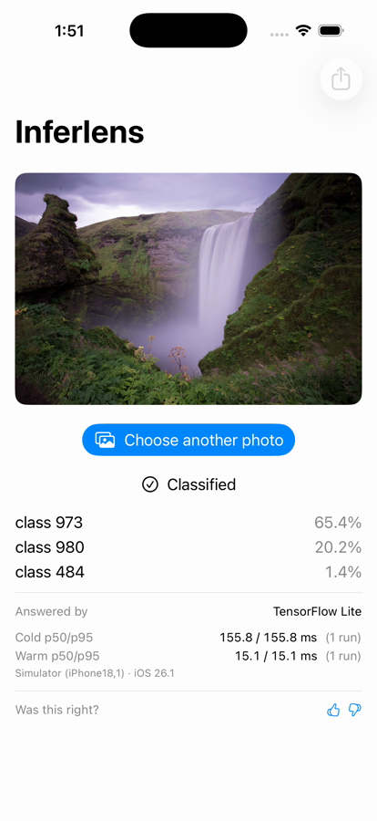
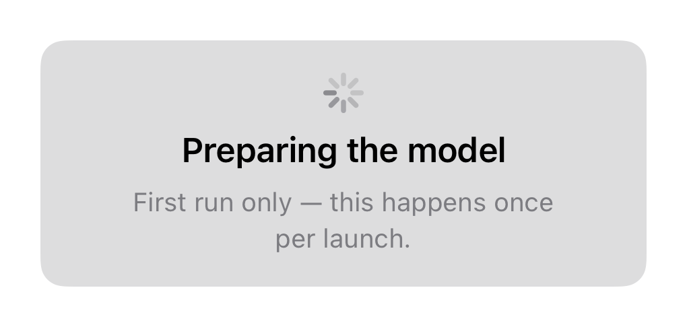
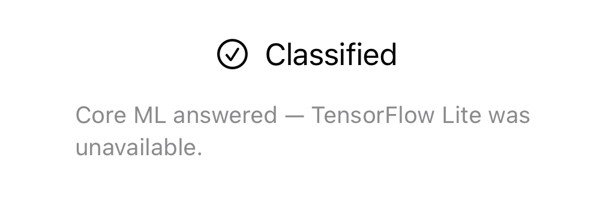
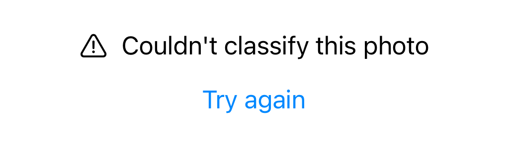
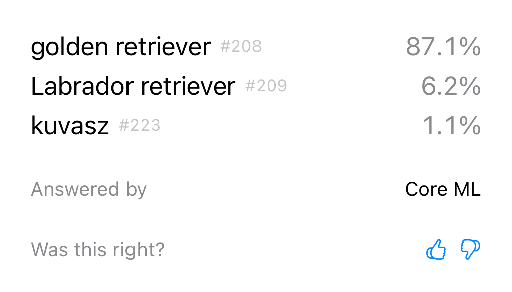

# Inferlens

On-device image classification for iOS that logs every inference to an append-only ledger, so
Core ML and TensorFlow Lite can be measured against each other on one iPhone.

[](https://github.com/sebkoo/inferlens/actions/workflows/build.yml)
[](.swift-version)
[](docs/adr/0001-module-boundaries.md)
[](LICENSE)

<a href="https://github.com/sebkoo/inferlens/releases/download/demo-sim-ac8d402/inferlens-shell-demo.mp4"></a>

Pick a photo. The app runs it through a fallback chain, TensorFlow Lite first and Core ML behind
it, and shows the top three labels, which engine answered, and p50/p95 latency split into cold
(the first run after a load) and warm. A thumbs up or down on the result is stored beside the
run. Every run and every judgement is appended to a local SQLite ledger and can be exported as
NDJSON, which a small CLI evaluates offline to recommend a backend, or to refuse when the rows
are too few.

```
run → ledger → thumbs → export → evaluate → choose next backend → run
```

[43-second demo recording](https://github.com/sebkoo/inferlens/releases/download/demo-sim-ac8d402/inferlens-shell-demo.mp4)
(iPhone 17 Pro simulator, iOS 26.1, before the pin moved) ·
[the rows that demo exported](https://github.com/sebkoo/inferlens/releases/download/demo-sim-ac8d402/exported-runs.ndjson)

## Results

| Engine | Model | Device / iOS | Cold p50 / p95 | Warm p50 / p95 | Peak memory | Runs |
|---|---|---|---|---|---|---|
| Core ML | MobileNetV2 FP16 (Apple) | — | — | — | — | — |
| TensorFlow Lite | MobileNetV2 1.0 224 FP32 (Google) | — | — | — | — | — |

No device has been measured yet.

## Quick start

Requires Xcode 26.6 (Swift 6.3) and an iOS 26 simulator or device.

```
git clone https://github.com/sebkoo/inferlens && cd inferlens
make bootstrap                  # fetch the checksum-pinned models, derive the label table
open App/Inferlens.xcodeproj    # run on iPhone 17 Pro (iOS 26.5), or on a signed device
```

`swift build` alone does not produce a working app: the models are fetched by script, and the
TensorFlow Lite runtime is a checksum-pinned SPM `binaryTarget`
([provenance](docs/research/MODEL_PROVENANCE.md), [ADR-0002](docs/adr/0002-litert-distribution.md)).
A device run needs `DEVELOPMENT_TEAM` in a git-ignored `App/Signing.local.xcconfig`; a clean
clone builds unsigned.

Offline eval over an export:

```
swift build --product inferlens-eval
.build/debug/inferlens-eval path/to/exported-runs.ndjson
```

## What the screen looks like

The five states the screen can be in, and the result it shows when one arrives.

| | |
|---|---|
|  | **Nothing chosen.** Waiting for a photo. |
|  | **Loading the model.** The whole cold start, since compile, prepare and warm-up happen inside one call. |
|  | **Classifying.** The photo is running through the engine. |
|  | **Answered, degraded.** A leg further down the chain answered, and the banner names both ends of the hop. |
|  | **Failed, retryable.** Nothing came back, and a second attempt could plausibly work, so the button is offered. |
|  | **The result.** Top three with confidence, which engine answered, and each label's index in the model's own output. |

Rendered from typed values by [`StateScreenshotTests`](Tests/InferlensUITests/StateScreenshotTests.swift)
on an iPhone 17 Pro simulator running iOS 26.5; no engine ran and no ledger row was written. The
three indices in the last image are the real positions of those labels in the shipped table
([ADR-0012](docs/adr/0012-label-table-provenance.md)).

## The state machine

```
idle → loadingModel → inferring → success(degraded: [DegradationReason])
                          │                     │
                          ▼                     │
                    failed(retryable:) ─────────┘
```

It has the shape a server AI UX has: model load is first-token latency, thermal throttle is the
degraded state, and the fallback chain is the cheaper-model path.

## How it is put together

Ten library modules plus a test-support target, in one SPM package, one direction of dependency:
`App → modules → InferlensCore`, with `InferlensCore` depending on nothing
([ADR-0001](docs/adr/0001-module-boundaries.md)).

| Module | The clause it serves |
|---|---|
| [`InferlensCore`](Sources/InferlensCore) | The contract every engine satisfies: `InferenceEngine` with typed throws and cooperative cancellation, value types for input, outcome and timing, and `LabelTable`. |
| [`InferlensCoreML`](Sources/InferlensCoreML/CoreMLEngine.swift) · [`InferlensLiteRT`](Sources/InferlensLiteRT/LiteRTEngine.swift) · [`InferlensRemote`](Sources/InferlensRemote/RemoteEngine.swift) | Run. Three actors over that contract: `MLModel` driven directly so preprocess and infer time apart, the TensorFlow Lite C API over a vendored xcframework, and a `URLSession` leg over a documented wire contract ([ADR-0013](docs/adr/0013-remote-leg-realization.md)). No public endpoint ships; the app composes the remote leg with `endpoint: nil`. |
| [`InferlensFallback`](Sources/InferlensFallback/FallbackEngine.swift) | Run, when the leading engine cannot. A chain of engines that is itself an engine, where a step down is data (`fellBack(from:to:)`) that reaches the screen and the ledger unchanged. |
| [`InferlensUI`](Sources/InferlensUI) | The screen and the state above it. Picking a new photo cancels the run in flight, and a cancelled run writes no row ([ADR-0014](docs/adr/0014-cooperative-cancellation.md)). |
| [`InferlensStore`](Sources/InferlensStore) | Ledger, thumbs, export. Append-only SQLite with versioned migrations, held by triggers inside the database file and proven from an outside connection; NDJSON export is byte-identical on re-export ([ADR-0006](docs/adr/0006-run-ledger-storage.md)). A JSON document store beside it holds the flag cache and nothing else ([ADR-0009](docs/adr/0009-document-store-scope.md)). |
| [`InferlensBench`](Sources/InferlensBench/LatencyRecorder.swift) · [`InferlensEval`](Sources/InferlensEval) | Evaluate. Nearest-rank p50/p95 over cold and warm runs, and an offline eval that calls the same recorder rather than reimplementing it and refuses to recommend below 20 warm rows per backend ([ADR-0015](docs/adr/0015-offline-eval-boundary.md)). |
| [`InferlensConformance`](Sources/InferlensConformance/AssertConformsToContract.swift) | One engine-agnostic conformance suite, run against every engine, including the remote leg against a loopback server the tests stand up. |

The app target ([`InferlensApp.swift`](Sources/InferlensApp/InferlensApp.swift)) is composition
only: it names the engines, opens the ledger, and hands the screen its closures.

## Tests and CI

205 XCTest cases across every module, run on an iPhone 17 Pro simulator on every push
([workflow](.github/workflows/build.yml)). The conformance suite fails a deliberately broken
engine; the ledger's append-only rule is checked by an `UPDATE` and a `DELETE` attempted from
outside the module; export is compared byte for byte on re-export; and the five states are drawn
by the test that produced the screenshots above.

## Limitations

- No device numbers yet. Everything measured so far ran on a simulator, and every row records the machine that produced it.
- Apple's model is FP16, Google's is FP32, and their weights differ, so the comparison is between two ecosystems ([ADR-0003](docs/adr/0003-benchmark-comparison-scope.md)).
- One architecture (MobileNetV2), one task, still images only. No camera mode, no streaming.
- No server stands behind the remote leg, and this repo makes no claim about any remote service's latency or accuracy.
- [`InferlensFlags`](Sources/InferlensFlags) provides a flag provider the app does not yet read.
- Not on the App Store; the committed Xcode project exists so the app can be installed and run.

## Next

Device benchmark and the table above · OSSignposter spans and MetricKit diagnostics · a live
camera mode · a retry policy for the remote leg · flags wired to the chain order. Tracked in
[Issues](https://github.com/sebkoo/inferlens/issues).

## Decisions

Short ADRs in [`docs/adr/`](docs/adr) cover module boundaries, LiteRT distribution, benchmark
scope, engine concurrency, ledger storage, README media, the latency-summary boundary,
document-store scope, the remote leg, the app shell, label provenance, cancellation, and the
offline-eval boundary. Background: [prior art](docs/research/PRIOR_ART.md) and
[model provenance](docs/research/MODEL_PROVENANCE.md).

## How it was built

With an AI coding agent (Claude Code) as a pair. The maintainer owns every design decision, every
timing and statistics choice, and every review; the agent wrote most first drafts. What the
prompts asked for and where they turned out wrong is in [docs/process.md](docs/process.md).

## License

[Apache-2.0](LICENSE).
